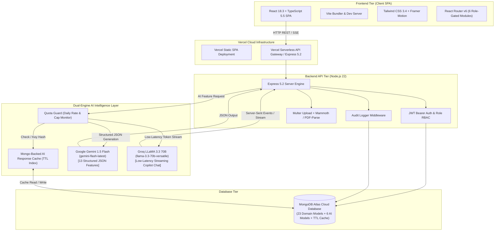
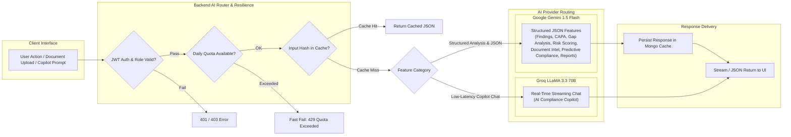

# AssessSphere — Product Quality Assessment System (PQAS)

[](https://asses-sphere.vercel.app/)
[](https://ai.google.dev/)
[](https://groq.com/)
[](https://react.dev/)
[](https://www.typescriptlang.org/)
[](https://vitejs.dev/)
[](https://tailwindcss.com/)
[](https://www.framer.com/motion/)
[](https://expressjs.com/)
[](https://www.mongodb.com/)
[](https://nodejs.org/)
[](https://asses-sphere.vercel.app/)

A role-based quality management platform for manufacturing: inspection plans and reports, supplier evaluation, calibration tracking, document management, and an **AI layer powered by Google Gemini & Groq** (compliance copilot, auto-generated findings/CAPA, gap analysis, risk scoring, predictive compliance, and more) laid on top of the core workflow.

Full breakdown of every technology choice and why — see **[TECH_STACK.md](./TECH_STACK.md)**.
Production Vercel deployment guide — see **[DEPLOYMENT.md](./DEPLOYMENT.md)**.

---

## 🚀 Live Deployed App

AssessSphere is deployed and live on Vercel:

👉 **[https://asses-sphere.vercel.app/](https://asses-sphere.vercel.app/)**

---

## 🏛️ System Architecture & Visual Representations

AssessSphere is built as a three-tier architecture with a specialized **Dual-Engine AI Layer** integrated directly into the API layer.

### 1. High-Level System Architecture



### 2. Dual-Engine AI Routing & Data Flow Pipeline



### 3. Visual Box Representation

```
+---------------------------------------------------------------------------------------------------+
|                                      FRONTEND CLIENT LAYER                                        |
|   React 18.3  |  TypeScript 5.5  |  Vite 5.3  |  Tailwind CSS 3.4  |  Framer Motion  |  Recharts   |
|   - 6 Role-Based Namespaces: Admin, Management, Production Manager, Stores Manager, QM, Inspector  |
+---------------------------------------------------------------------------------------------------+
                                                  |
                                           HTTP / REST API
                                                  v
+---------------------------------------------------------------------------------------------------+
|                                      BACKEND & API LAYER                                          |
|   Express 5.2 API  |  Node.js v22  |  JWT Bearer Auth  |  Role RBAC Guard  |  Multer Uploads     |
|   - Audit Logging Engine  |  Document Text Extractors (Mammoth DOCX & PDF-Parse)                   |
+---------------------------------------------------------------------------------------------------+
                        |                                                   |
                        v                                                   v
+---------------------------------------------------+   +-------------------------------------------+
|             DUAL-ENGINE AI LAYER                  |   |            PERSISTENCE LAYER              |
|                                                   |   |                                           |
|  +---------------------------------------------+  |   |   MongoDB Atlas (Cloud Cluster)           |
|  | Quota Guard (20 req/day buffer)             |  |   |   - Mongoose 9 ODM                        |
|  | Mongo Cache (72h / 168h TTL hash cache)    |  |   |   - 23 Core Domain Collections            |
|  +---------------------------------------------+  |   |   - 6 AI Audit & Output Collections       |
|            |                         |            |   |   - AICacheEntry TTL Auto-Index           |
|            v                         v            |   +-------------------------------------------+
|   Google Gemini 1.5 Flash         Groq AI         |
|   (gemini-flash-latest)    (llama-3.3-70b)       |
|   - 13 Structured JSON      - Low-Latency       |
|     Generation Features       Streaming Chat      |
+---------------------------------------------------+
```

---

## 🛠️ Complete Tech Stack Matrix

| Layer | Technology / Package | Version | Primary Role in AssessSphere |
|---|---|---|---|
| **AI Engine (Structured)** | **Google Gemini 1.5 Flash** | `@google/generative-ai` `^0.24.1` | Powers 13 structured AI capabilities (findings, CAPA, gap analysis, evidence validation, risk scoring, report generation) via native JSON schema output. |
| **AI Engine (Streaming)** | **Groq LLaMA 3.3 70B** | `groq-sdk` `^1.3.0` | Powers the real-time, low-latency AI Compliance Copilot streaming chat UI (`llama-3.3-70b-versatile`). |
| **AI Resilience** | **Quota Guard & Mongo Cache** | Custom Engine | Local daily quota monitor for Gemini free-tier limits + MongoDB SHA-256 hashed response cache with TTL auto-invalidation. |
| **Frontend Framework** | **React** | `18.3.1` | Declarative UI framework powering ~60 pages across 6 role-based workflow modules. |
| **Frontend Language** | **TypeScript** | `5.5.3` | End-to-end strict type safety for component props, API request/response payloads, and state models. |
| **Build & Tooling** | **Vite** | `5.3.4` | Lightning-fast development server with instant HMR and optimized production SPA bundling. |
| **Styling & UI** | **Tailwind CSS** | `3.4.7` | Utility-first styling system backed by HSL CSS variables for light/dark theme support. |
| **Animation & FX** | **Framer Motion** | `11.3.19` | Smooth page transition fades, slide-in AI Copilot drawer panel, collapsible findings, and modal animations. |
| **Data Visualization** | **Recharts** | `2.12.7` | Executive & manager quality dashboards, defect trend charts, and supplier rating visualizations. |
| **Drag & Drop** | **@dnd-kit** | `6.1.0 / 8.0.0` | Drag-to-reorder interface for manufacturing/assembly stages and inspection checklist builder. |
| **Notifications** | **Sonner** | `1.5.0` | Elegant, stacked toast notifications for user actions, API alerts, and AI processing statuses. |
| **Icons** | **Lucide React** | `0.408.0` | Consistent icon set across navigation sidebars, status badges, and action buttons. |
| **Backend Runtime** | **Node.js** | `v22.x` | Modern ECMAScript module (ESM) JavaScript/TypeScript execution runtime. |
| **Backend Framework** | **Express** | `5.2.1` | Enterprise REST API router with built-in async error handling and middleware execution chain. |
| **TypeScript Engine** | **tsx** | `4.23.0` | High-performance TypeScript execution engine with hot-reloading watch mode for backend development. |
| **Database & ODM** | **MongoDB Atlas + Mongoose** | `9.7.4` | Cloud document database managed via Mongoose ODM (29 collection schemas: 23 core domain + 6 AI persisted models). |
| **Authentication** | **JWT (`jsonwebtoken`)** | `9.0.3` | Stateless Bearer token authorization with role claims passed in request headers. |
| **Security & Hashing** | **bcryptjs + Helmet** | `3.0.3 / 8.3.0` | Password hashing with 8-char min rule, HTTP perimeter hardening, and CORS origin allowlists. |
| **Document Processing**| **Multer + Mammoth + PDF-Parse**| `2.2.0 / 1.12.0 / 2.4.5` | Multipart file upload handling & plain text extraction for PDF / DOCX QMS evidence files. |
| **Deployment** | **Vercel Cloud Platform** | Production | Frontend static SPA hosting with automatic rewrite routing + Express API serverless functions. |

---

## 🚀 Quick start

The repo is two independent apps in their own folders. Start the **backend** first (the frontend just talks to it over HTTP), each in its own terminal.

**1. Backend** — Express API on :3001

```bash
cd backend
npm install
cp .env.example .env       # then fill in GEMINI_API_KEY, GROQ_API_KEY, MONGODB_URI, JWT_SECRET
npm run seed               # populates MongoDB with the demo organization, users & catalog data
npm run dev                # API on http://localhost:3001 (auto-restart on change)
```

**2. Frontend** — React SPA on :5173, in a second terminal

```bash
cd frontend
npm install
cp .env.example .env       # VITE_API_URL / VITE_AI_API_URL already point at localhost:3001
npm run dev                # SPA on http://localhost:5173
```

Frontend: `http://localhost:5173` · API: `http://localhost:3001/api`

Run `npm run verify:ai` from `backend/` any time the API is up to smoke-test all 15 AI features end to end (mind the free-tier Gemini quota — see [TECH_STACK.md §4](./TECH_STACK.md#4-ai-integration)).

---

## 🔑 Demo credentials

Seeded by `npm run seed`, one account per role:

| Email | Password | Role |
|---|---|---|
| admin@qmics.com | Admin@2025 | Admin |
| management@qmics.com | Mgmt@2025 | Management |
| production@qmics.com | Prod@2025 | Production Manager |
| stores@qmics.com | Store@2025 | Stores Manager |
| quality@qmics.com | Qual@2025 | Quality Manager |
| inspector@qmics.com | Insp@2025 | Inspector |

---

## 📁 Project structure

Two self-contained apps, each with its own `package.json`, `.env`, and `node_modules`:

```
backend/                      Express + MongoDB API — install & run this first
  package.json                Backend deps + scripts (dev, start, seed, verify:ai, typecheck)
  .env(.example)              DB URI, JWT secret, AI keys, cache TTLs, quotas, allowed origins
  tsconfig.json
  app.ts                      Express app instance (CORS, JSON body limit, mounts /api, DB middleware)
  index.ts                    Standalone Express server listener
  api/index.ts                Vercel Serverless Function entrypoint
  db.ts                       MongoDB connection & connection pooling
  seed.ts                     Demo data seeder
  verify-ai.ts                End-to-end smoke test for all 15 AI features
  models/                     Mongoose models (core domain + AI-specific)
  routes/                     Core CRUD routes: admin, inspection-plan, inspection-report,
                               product-quality-plan, supplier-evaluation, dashboard, role,
                               document, production-plan, audit-log, auth
  middleware/                 auth.ts (JWT guard + requireRole), auditLogger.ts (audit trail)
  ai/
    adapters/                 gemini.ts, groq.ts — thin wrappers over each provider's SDK
    features/                 One file per AI feature (findings, capa, gap-analysis, ...)
    routes/ai.routes.ts       All /api/ai/* endpoints
    quotaGuard.ts             Fails fast once the Gemini free-tier daily cap is close
    cache.ts                  Mongo-backed response cache for Gemini-backed features
    system-prompts.ts         Shared system prompts per feature domain
  uploads/                    Uploaded documents & calibration certs (gitignored, runtime)

frontend/                     React + Vite SPA — install & run second
  package.json                Frontend deps + scripts (dev, build, preview, typecheck)
  .env(.example)              VITE_API_URL / VITE_AI_API_URL — where to reach the backend
  index.html, vite.config.ts, tailwind.config.ts, postcss.config.js, tsconfig*.json
  src/
    pages/                    Admin module pages (flat, role-gated by ProtectedRoute)
    pages/admin/              AI Settings page
    pages/management/         Management role dashboards
    pages/production-manager/ Production Manager pages
    pages/stores-manager/     Stores Manager pages
    pages/quality-manager/    Quality Manager pages
    pages/inspector/          Inspector pages
    components/ai/            AI Copilot panel, findings panel, gap analysis page, badges
    components/shared/        Cross-role widgets (DataTable, PageWrapper, StageTimeline, ...)
    components/layout/        Sidebar, Topbar, ModuleLayout chrome, nav configs
    layouts/                  AdminLayout, ModuleLayout
    context/                  AuthContext (JWT), ThemeContext
    hooks/                    useApi.ts (REST client hooks), useAI.ts (AI feature hooks)
    lib/                      api.ts (REST client), utils, exporters, chart colors
```

---

## 🛡️ Role-based modules

Each role logs into its own route namespace, guarded by `<ProtectedRoute allowedRoles={[...]} />`:

| Role | Base path | Pages |
|---|---|---|
| Admin | `/admin` | Dashboard, Organization, Departments, Users, Roles, Products (+detail), Components, Mfg/Asm Stages, Inspection Types, Equipment, Inspection Methods, Documents, Materials, Material Types, Suppliers, Settings, AI Settings |
| Management | `/management` | Product / Manufacturing / Assembling / Material quality dashboards, Supplier evaluation dashboard |
| Production Manager | `/pm` | Dashboard, Mfg/Asm/Material/Component inspection plans, Production Plans, Review Reports, Quality Plan Review |
| Stores Manager | `/sm` | Dashboard, Material Received Plans, Review Material Reports, Supplier Evaluations, Approved Vendors, Stock Statement, Material Quality & Supplier Performance dashboards |
| Quality Manager | `/qm` | Dashboard, Quality Plans, Assign Inspectors, Checklists, Calibration Approvals, Review Reports, **AI Gap Analysis**, 6 quality dashboards |
| Inspector | `/inspector` | Dashboard, Material/Component/Assembly/Final Product Reports, Calibration Report |

`/admin/profile` is reachable by any authenticated role (shared profile page). `/app` redirects each logged-in user to their own module's dashboard.

---

## 🤖 AI features

15 AI-backed capabilities live behind `/api/ai/*` — split between Google Gemini 1.5 Flash (for structured JSON generation) and Groq LLaMA 3.3 70B (for low-latency streaming compliance copilot chat). Full endpoint list, provider split, and the cost/quota engineering behind them: **[TECH_STACK.md §4](./TECH_STACK.md#4-ai-integration)**.

| Endpoint | Feature | Engine Provider | Model Target | Primary Function |
|---|---|---|---|---|
| `POST /api/ai/findings` | AI Findings Generator | **Google Gemini** | `gemini-flash-latest` | Auto-generate structured defect findings from inspection values |
| `POST /api/ai/capa` | CAPA Engine | **Google Gemini** | `gemini-flash-latest` | Recommended Corrective & Preventive Actions with risk severity |
| `POST /api/ai/copilot` | AI Compliance Copilot | **Groq AI** | `llama-3.3-70b-versatile` | Real-time streaming compliance assistant chat |
| `POST /api/ai/gap-analysis` | AI Gap Analysis | **Google Gemini** | `gemini-flash-latest` | Parse uploaded QMS documents & evaluate ISO/compliance gaps |
| `POST /api/ai/validate-evidence` | Smart Evidence Validation | **Google Gemini** | `gemini-flash-latest` | Audit uploaded certificates and verify compliance evidence |
| `POST /api/ai/document-intel` | AI Document Intelligence | **Google Gemini** | `gemini-flash-latest` | Summarize & extract metadata from technical standards |
| `POST /api/ai/risk-score` | Intelligent Risk Scoring | **Gemini / Math Formula** | `gemini-flash-latest` | Calculate risk priority numbers (RPN) with AI rationale |
| `POST /api/ai/quality-score` | Quality Scoring Engine | **Gemini / Math Formula** | `gemini-flash-latest` | Automated batch and product quality rating calculation |
| `POST /api/ai/scheduling` | Smart Assessment Scheduling | **Algorithmic Engine** | Pure Algorithm | Automated inspection and calibration schedule balancing |
| `POST /api/ai/report` | Generative Reports | **Google Gemini** | `gemini-flash-latest` | Generate executive quality summary reports |
| `POST /api/ai/maturity` | Predictive Maturity Model | **Google Gemini** | `gemini-flash-latest` | Evaluate plant QMS maturity tier and progress metrics |
| `POST /api/ai/predict` | Predictive Compliance | **Google Gemini** | `gemini-flash-latest` | Forecast quality risks and non-conformance probabilities |
| `POST /api/ai/benchmark` | Benchmarking Intelligence | **Google Gemini** | `gemini-flash-latest` | Compare quality KPIs against industry standards |
| `POST /api/ai/executive-summary` | Executive AI Dashboard | **Google Gemini** | `gemini-flash-latest` | Dynamic natural-language briefing for top management |
| `POST /api/ai/checklist` | AI Assessment Assistant | **Google Gemini** | `gemini-flash-latest` | Generate custom quality inspection checklists |

The **AI Settings** page (`/admin/ai-settings`) shows live provider health, per-feature usage stats, and lets you toggle features off client-side.

---

## 📜 Scripts

Run each inside the folder that owns it.

**backend/**

| Command | What it does |
|---|---|
| `npm run dev` | Start the API with auto-restart on change |
| `npm run start` | Start the API once (no watch) |
| `npm run seed` | Seed MongoDB with demo data |
| `npm run verify:ai` | Smoke-test every AI feature end to end |
| `npm run typecheck` | Type-check the backend |

**frontend/**

| Command | What it does |
|---|---|
| `npm run dev` | Vite dev server on :5173 |
| `npm run build` | Type-check + production build |
| `npm run preview` | Serve the production build locally |
| `npm run typecheck` | Type-check the frontend |

---

## ⚙️ Environment variables

Each app has its own `.env`, copied from the adjacent `.env.example`:

- **backend/.env** — required: `GEMINI_API_KEY`, `GROQ_API_KEY`, `MONGODB_URI`, `JWT_SECRET`. Everything else (`PORT`, cache TTLs, model names, upload size limit, quota buffer, `ALLOWED_ORIGINS`) has a sensible default.
- **frontend/.env** — `VITE_API_URL` and `VITE_AI_API_URL` tell the SPA where the backend is (default `http://localhost:3001`).
